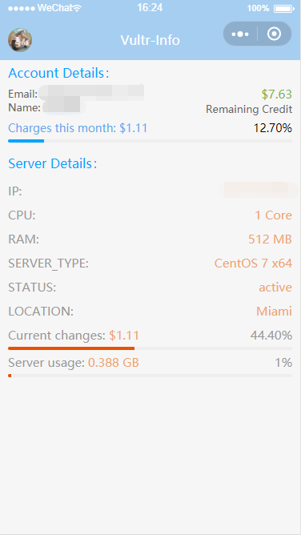
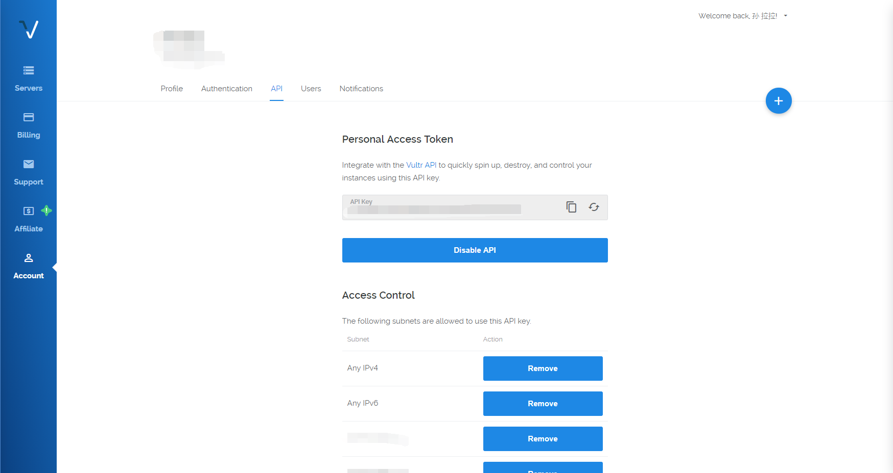

# :cloud: Vultr Info
使用 *小程序·云开发* 的 Vultr 服务器账户查询小工具。

Vultr Info 利用 [Vultr](https://vultr.com) 提供的 API 查询您的账户余额、账户信息以及本月花销。

## 1. 申请自己的 API Key

访问链接 :link: [Vultr API Key](https://my.vultr.com/settings/#settingsapi) 来生成您自己的 API Key，此脚本依赖于 API Key 与 Vultr 账户进行沟通。

## 2. 更改 API 的 IP 使用权限

Vultr 的 API 权限管理很合理。
请在刚刚 API Key 申请页面下面的 *Access Control* 部分将您自己的 IP 地址添加至白名单（或者允许全部 IPv4 地址访问）。

## 3. 替换 API Key 和 Server SubId

将 `cloudfunctions -> getVultrInfo -> config.js` 替换成自己的 API Key 和 Server SubId。

这样运行，就可以显示您 Vultr 云账户中包括账户邮箱、账户姓名、余额、本月使用金额、服务器信息等信息。

注：可以在 vscode 中 安装 [REST Client](https://marketplace.visualstudio.com/items?itemName=humao.rest-client) 插件，然后新建一个以`.http` 的文件，然后把 `curl -H 'API-Key: YOUR_OWN_API_KEY' "https://api.vultr.com/v1/server/list"`粘贴到文件里，然后点击 `Send Request`，可以获取到 `Server SubId`。  

__参考[spencerwooo/jsbox-vultr-helper](https://github.com/spencerwooo/jsbox-vultr-helper)__